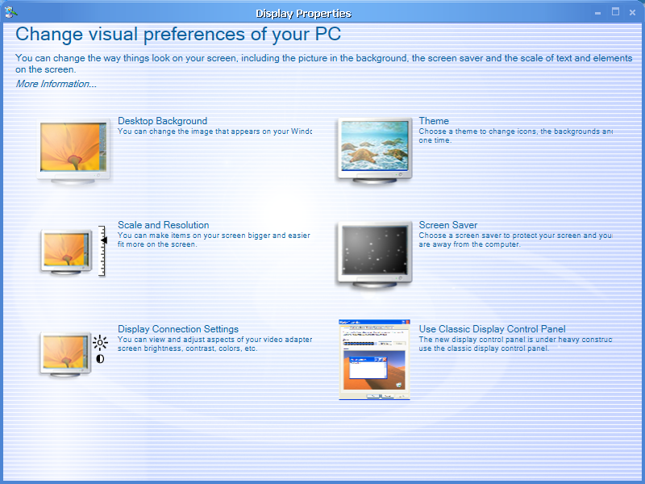
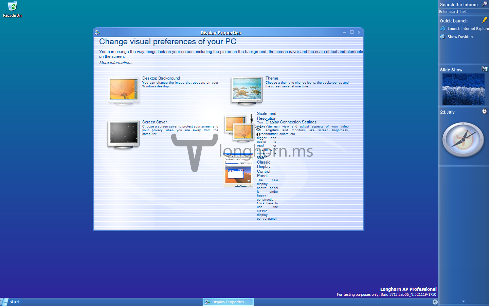
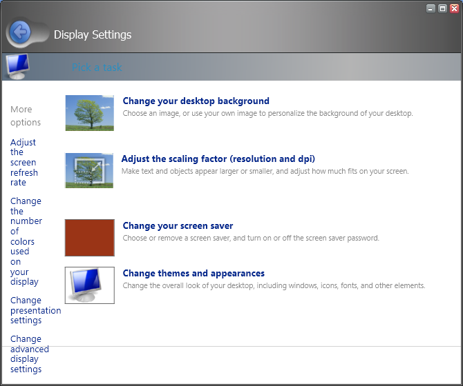

Only two builds, build 3683 and build 4093 have a working, accessible Display Properties control panel, out of the box. These two Avalon display panels are extremely different in construction, and it is entirely possible that the two are the result of two entirely different development efforts, baring no connection beyond their function and underlying technology. Later Milestone 3 builds can have the 3683-style enabled through the use of a registry key, as detailed below.

#### Milestone 3

In build 3683, it is accessible by right-clicking on the desktop and selecting Properties from the right click menu, as one would with any previous version of Windows. The Avalon display panel in 3683 has a number of bugs however. Later builds have even further bugs, caused by a lack of further development to ensure that it kept pace with the rapidly changing framework. The last confirmed build to contain the Milestone 3 Avalon display panel is 4001.



It was first activated in one of the other Milestone 3 builds as part of the protoPlex Project in early 2008 as depicted in the screenshot below. It was achieved by simply copying in the 3683 desk.cpl, and executing that rather than the version native to that build. This step was then forgotten about and was not investigated further. In 2012, this screenshot was rediscovered, prompting further investigation. This investigation has revealed that it can be enabled in other 3xxx builds by simply using the registry file below:

```
Windows Registry Editor Version 5.00

[HKEY_CURRENT_USER\Control Panel\Desktop]
"ClassicDisplayCPL"=dword:00000000
```

This works because 3683 assumes that if this registry key doesn’t exist, then the user has indicated that they want to use the new display panel. In later builds, this behaviour was changed so that it required the registry key to be present and explicitly set to 0 before displaying the new panel.



As you can see from the above screenshot, in later builds, there are some rendering errors. This confirms previous suspicions that development of this feature was insufficient to retain full compatibility with the rapid development of the Avalon framework at the time. This would also explain why the feature was cut at the start of Milestone 4.

#### Milestone 7

In build 4093, you have to run `lhdesk.exe` in order to access the display panel. There is no option to integrate it into the existing user interface. The display panel bares little resemblance to the earlier effort.

