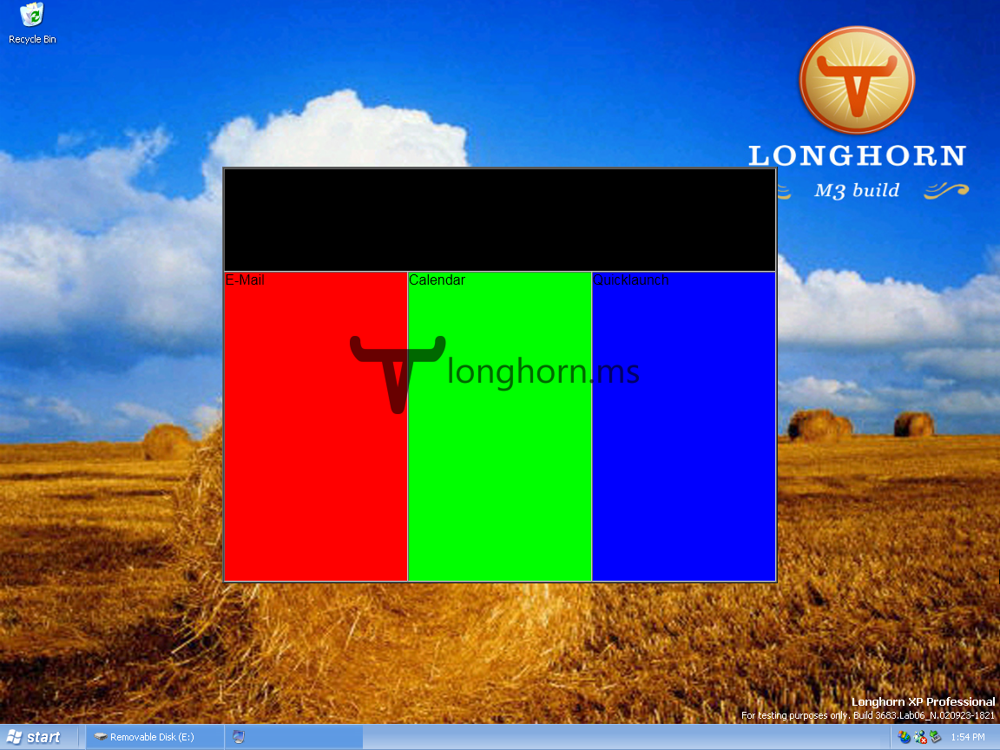

The Longhorn Startpage is a feature present in Milestone 3 builds. The startpage appears to be an early attempt at replacing the [OOBE (Out-Of-Box Experience)](/oobe) that these builds carry over from Windows XP.

Already in build 3683 we can catch a glimpse of the startpage, be it in a very early stage. The code for the startpage can be found in the assemblies _Microsoft.Windows.Client.dll_ and _ShellInterop.dll_ It's interesting to note that one assembly holds both the CAML and XAML for the startpage (which differ a tiny bit from each other) and the other assembly holds the code back-end of the whole thing. A "PromotionsTile' that is loaded just shows up as a solid black color.

By the time of build 3706 the startpage progressed further and is much more advanced. The promotion tile that was also seen in 3683 now plays a key role. The tile now serves the user with various tasks he can complete to personalize his computer. If the user doesn't want to complete a task, he has the option to simple skip the task. Completed tasks could easily be made undone again. No examples of tasks are included in the assemblies. A task will open notepad when clicked by default. The status of the tasks is saved in the registry. This registry key reveals that the startpage was meant to be part of the OOBE: `HKEY_CURRENT_USER\Software\Microsoft\Windows\CurrentVersion\Explorer\TaskPromotions\OOBE`.

It looks like the button in the upper corners are there for the sole purpose of debugging the application. The Go button (re)loads the application and plays a little animation. The X button will close the application.



In later builds (3713 through 4001) the startpage lacks the "debug buttons'. Both the animation and the data are now automatically loaded on start. The current user's wallpaper fades in as part of the animation. The glassy border is gone and the page now includes the user's avatar.



As in build 3706, the promotions are loaded from an external location: `\\shelltest\scratch\ewad\`. The application tries to read the file oobe.xml in this location. By reverse engineering the code we were able to reconstruct the XML file:


<root>
	<promotion>
		<UID>12345</UID>
		<priority>1</priority>
		<display_message>This is a sample task.</display_message>
		<help_message>none</help_message>
		<category>test</category>
		<displayed>not used</displayed>
		<created>01-01-2000</created>
		<expires>01-01-2050</expires>
		<requirements>
			<applications>NONE</applications>
			<hardware>NONE</hardware>
			<network>NONE</network>
		</requirements>
	</promotion>
</root>


Note how multiple requirements can be set for each task. Because the startpage for some reason bugs out reading the oobe.xml file you will always need to add more than one `<promotions>` element as it ignores the first one. Build 3706 is completely unable to start when more than one `<promotions>` element is present in the file.

If you want to use the oobe.xml file yourself, you will need to set the computername to _shelltest_ (reboot required) and create the required directories (scratch/ewad) and oobe.xml file. Now just share the scratch folder. Try browsing to `\\shelltest\scratch\ewad\`. If the address is resolved correctly you are all set!

#### Startpage launcher

For a long time the startpage was considered as "not accessible" because every trace of a launcher was missing and only one screenshot of the startpage in action was available. I was able to contact the original creator of both the launcher and screenshot: Stanimir Stoyanov. Stanimir wrote this launcher back in 2006 and now is finally publicly available. The launcher is written in C++ and creates a COM object registered as CShellStartPage. This is the startpage code as registered by ShellInterop.dll.

[Startpage Launcher](/download/startpage-launcher.zip)

#### Startpage & Welcome Center

It seem the Startpage made its way into Vista as the Welcome Center. The Welcome Center in Vista has exactly the same purpose as the startpage; getting the user started on the system with various promotions and offers.



##### Special thanks to Stanimir for sharing his launcher and helping me to recreate oobe.xml