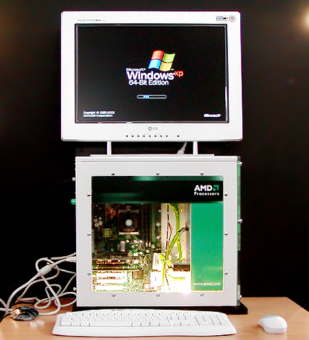

If you ever bothered to take a look at one of the 64-bit Longhorn compiles, you may have noticed that these builds are extremely empty and lack, for example, the sidebar. There's a good reason why these compiles lack lots of features the x86 Longhorn compiles did have.

#### A new architecture

When the development of Longhorn began the 64-bit processors we know today did not exist yet. In 1994 Hewlett Packard partnered with Intel to create a new 64-bit architecture based on an earlier development called "EPIC". This joint venture resulted in the IA-64 architecture that was used with Intel's Itanium range of processors. Remarkable is the lack of backwards compatibility of the IA-64 architecture with x86 instructions. The first Itanium processor was launched in June 2001.

In reaction to Intel's IA-64 architecture AMD began development of its own architecture. AMD's new architecture was an extension of x86 and still supported all legacy instructions. For this reason it was often called x86-64. AMD released its first 64-bit processor (Opteron) in April 2003. AMD's architecture is often referenced as AMD64. Nowadays x64 editions of Windows still carry a AMD64 tag in their buildstring. After AMD64 was a fact, Intel also started working on a x86-64 processor. Intel implemented the same instruction set AMD had created, but made some minor changes. This resulted in the Intel64 architecture. Generally all x86-64 processors are just called x64 or AMD64.

#### A new Windows

With the new x64 architecture and its extended capabilities a new version of Windows was also needed to take full advantage of those capabilities. While installing a x86 edition of Windows on x64 hardware is more than possible, it's not going to get you any more performance. To get the most out of 64-bit a x64 edition of Windows was developed based on the Server 2003 codebase. The first special AMD64 compile known is build 5.2.3790.1033, compiled at 7 July 2003. This build still uses the '64-bit Edition' branding that was meant for IA-64 Windows editions. Later builds started using the final "x64 Edition" branding. The first x64 Windows builds were rather primitive in that they were unable to run some of the standard x86 Windows applications.

#### Windows on Windows

To solve software compatibility a compatibility layer was added to both IA-64 and x64 editions of Windows. This layer is called "Windows on Windows" or WoW. In x64 editions of Windows, WoW provides legacy x86 applications with x86 versions of common used/referenced Windows files in `C:\Windows\sysWoW64` and also a x86 copy of the registry in WoW6432Node. When a x86 application is run the processor switches to x86-mode, so no emulation is needed. In IA-64 editions WoW handles all tasks described above, but in addition also emulates the x86 architecture since IA-64 is completely incompatible with x86 instructions.

WoW core files:
* WoW64.dll
* WoW64win.dll
* WoW64cpu.dll

####  Compiling Windows for x64

The x64 edition of Windows is basically the same code as the x86 edition. The code is almost architecture neutral, it just has to be compiled by another compiler. This compiler depends on the architecture's instruction set. Some parts of Windows that are not written in higher-level languages (C or C++) do need a re-write. An example is the Hardware Abstraction Layer (HAL) which is written in the architecture specific language assembly.

#### Longhorn x64

So, why are Longhorn x64 builds so empty? Firstly, you have to take into account that at the time the first x64 Longhorn build appeared (October 1st 2003) the x64 was still very new and work was still being done. More importantly, a x64 edition of the .NET framework was not available at the time. This is the exact reason the x64 Longhorn versions lack all of the fancy user interface related stuff: sidebar, preview panel, search pages, help and support.. It's all not there since all those features rely on .NET. Of course, the x86 .NET edition could have been used, but what's the point in having a x64 enabled computer when all software is running in x86-mode anyway? Build 4083 is a bit special in that it has the base .NET framework implemented. The Avalon API is not yet fully implemented.