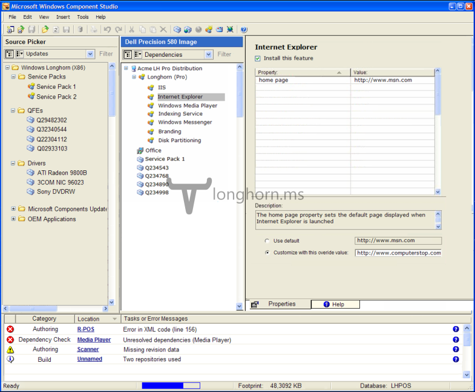

At WinHEC 2003 Microsoft revealed that Longhorn would be build from the ground up from a list of components. Already before this time various people at Microsoft had stated that Longhorn would be the first "modular" operating system. But what does this all mean? I'll try my best to get clear what componentising really is.

#### Bits and bobs

Basically, componentising Windows means breaking all of Windows' features into bits, called components. A feature can be something like WinFS, Internet Explorer, Terminal Services, TCP/IP etc. Each feature can contain a single component or a series of components. A feature also has a manifest which details its properties and the components included. A single component is made up of resources (files, registry entries) and can have dependencies on other components and/or features.

Due to Windows being split into components, it's fairly easy to specify which features to install. Though the componentising didn't only go as far as single features, but it would also affect how SKUs are built. Longhorn itself was to be broken down in several building blocks, one of them being the "base OS' component. The base OS component is, as the name suggests, the absolute base of Windows and language independent. To create a new Windows SKU, for example Home Edition, Microsoft or OEMs simply add a set of features to the base OS component. Another SKU, e.g Professional includes the base OS component, all features from Home Edition plus Professional features. Because, in this case, Professional is a superset of Home Edition and it literally builds on top of Home Edition's base. Since the base OS and the features are language neutral a language component must be installed. In earlier versions of Windows the language was hard-coded which made it very difficult to change language once Windows was installed. With the new multi-lingual user interface (MUI) and language components this problem was solved.

As with XP Embedded a piece of software was provided that would make it possible to add and remove components to a new or existing Longhorn OS images and change properties of components. This software is referred to as Target Designer or Windows Component Studio. A version of this software can also be found in build 4083, 4084 and 4093. Due to a missing dll the application is not fully loaded, but the main window will show. The image below was obtained from a WinHEC 2004 presentation describing the Longhorn build process.

[Fixed Target Designer for 4084](/download/fixed-target-designer-for-4084.zip)

###### Special thanks to JaGoTu for creating a registry fix to get the Target Designer to show

#### Componentising Longhorn

To place everything in perspective; the componentising of Longhorn was announced at the WinHEC 2004 conference in May 2004. The WinHEC 2004 build, 4074, itself was not componentised in any way yet. The first build that shows signs of the componentising process going on is build 4083 so it's very likely componentising only started with the 408X range of Longhorn. A clear trace of the componentising effort going on in these builds is the lack of features and an "unstaged" file repository located in `C:\build`. This file repository houses all components, each in a different folder. Included in each folder is a manifest file, `component.man`. The manifest file includes information about the component or feature such as dependencies, descriptions and more.

Componentising an operating system after all code has been written can be done, but also is very hard to accomplish. A part of the componentising effort was moving code to different places to limit the amount of dependencies. An important goal was to try to prevent any lower-level-APIs relying on higher-level-APIs. This way parts of the higher-level-API could be left out when needed, leaving the lower-level-APIs and Windows fundamentals unharmed. Especially this point was very hard to accomplish with Longhorn; most part of Longhorn's user interface relied on the high-level .NET framework to function. While this doesn't have to be a problem per say, in this case it actually was beginning to form a problem. Code simply wasn't put in the right places, not the places "were it should logically live'. Instead of moving code to a lower-level, they would just link the lower-level code parts to rely on the higher-level assembly. In the end this would lead to circular dependencies that are very difficult to resolve.

To make the componentising of Longhorn easier a lot of broken or half-working features and their code were scrapped. This made it a more doable job to cut Windows into different components. Still, most components were too interdependent with others which made it very hard to cut parts of Windows down into smaller bits. Even though the componentising of Longhorn kind of succeeded, the reset was luring around the corner already.

##### Special thanks to Thomas for providing loads of valuable information while writing