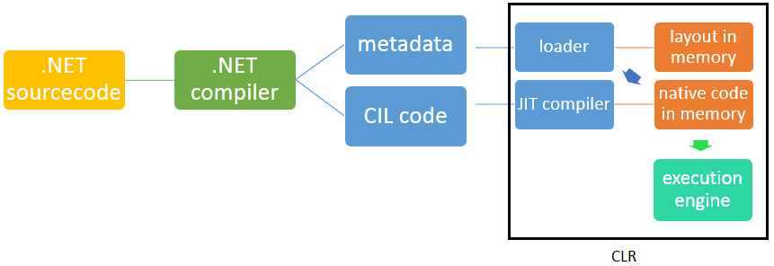

A significant part of Longhorn is written in managed C#. Taskbar, sidebar, preview pane&#8230; it's all .NET. I thought it would be interesting to know the mechanics behind this framework, so here we go: an article solely about .NET.

Of course, first we need to write our program in a .NET language. When the time has come to test the application you'll first need to compile it to an assembly we can execute. Compiling will usually be done by the MSBuild .NET compiler (previously all .NET languages had their own compiler). This compiler does not compile your source code to native machine code, but instead compiles it to an abstract intermediate form. This might seem a bit vague, but it basically means that your high-level managed code is converted to a lower-level coding format, called bytecode. This bytecode is much easier for a computer to interpret than your high-level source code and is both platform and language independent.

#### Platform independence

Platform independence is a great thing. Compiling your source to native machine code directly would mean that executing of the application is limited to computer with that exact configuration. Compiling to an intermediate form (bytecode) leaves the possibility to run the application on all sorts of computer configuration. In theory , the application could run on all .NET enabled devices.

#### Language independence

Since the bytecode is language neutral it's possible for different .NET languages to interoperate between compiled assemblies; all source code will compile to the same bytecode anyway. As not all languages have the same rules, a new set of rules was created to ensure optimal compatibility between assemblies written in various languages. This set of rules is called Common Language Specification (CLS). CLS is recommended, but not mandatory. Applications that meet the CLS rules are marked as CLS-compliant.

To illustrate the language independence, I took the time to write a console application in both Visual Basic and C#. The application does no more than printing "hello world!" in the console. For both applications the bytecode (IL) representation of the functional part was identical:


{
  .entrypoint
  IL_0000: nop
  IL_0001: ldstr "hello world!"
  IL_0006: call void [mscorlib]System.Console::WriteLine(string)
  IL_000b: nop
  IL_000c: ret
}


####  Intermediate form in detail

The abstract intermediate representation of a .NET application consists of two main components: meta-data and managed code. The meta-data contains all the descriptions for the structural items (classes and its members, attributes etc.) and the relationships between the various modules in the application. The managed bytecode holds all the functionality of the application encoded in Microsoft Intermediate Language (MSIL) or Common Intermediate Language (CIL). The intermediate language is the lowest-level program code of the Common Language Infrastructure.

&nbsp;

#### The CLR _Virtual Machine_

Of course, the .NET application also has to be executed at some point. Executing the .NET application is handled by the Common Language Run-time (CLR). The CLR manages the CIL code. Its tasks are to verify and convert types when needed, manage exception handling and to collect garbage (identification and disposal of unused objects).

Interpreting the abstract intermediate representation is done by two subsystems of the CLR. A loader reads the meta-data and based on that creates a layout of the application's classes and members in memory. The loader loads on-demand (only when a class is referenced). The Just-in-time compiler compiles CIL code based on what the loader reports back. CIL code gets compiled to native machine code and then executed. Note that no CIL code is actually executed. As with the loader, the JIT compiler also only compiles on-demand (only compiling when a class is called). A compiled method/class stays in memory as long as there is space available.

#### .NET framework and Java

It's uncanny how much .NET and Java have in common. One might almost thing that Java is a rip-off of .NET, but nothing is less true. Since Java came into existence earlier, .NET can be considered a Java rip-off. In a try of Microsoft's to _embrace, extend and exterminate _Java they created the Micorsoft Java VM (MSJVM). Microsoft was, however, sued by Sun Microsystems because of their incomplete Java implementation in 1997. In 2001 Microsoft settled with Sun and agreed to stop MSJVM support. With their campaign "JUMP to .NET" they tried to get as many Java users to use .NET. Clearly, Microsoft failed to exterminate Java since it's still used everywhere. Java is favourable when it comes to platform independence: it literally runs on all systems you can image whereas .NET only runs on Microsoft devices.