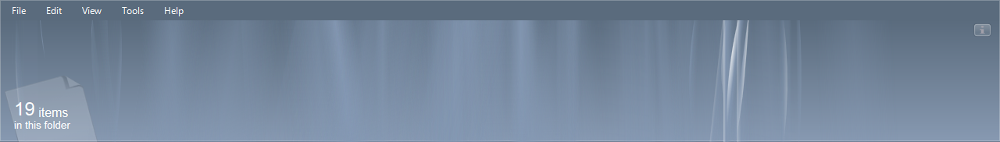
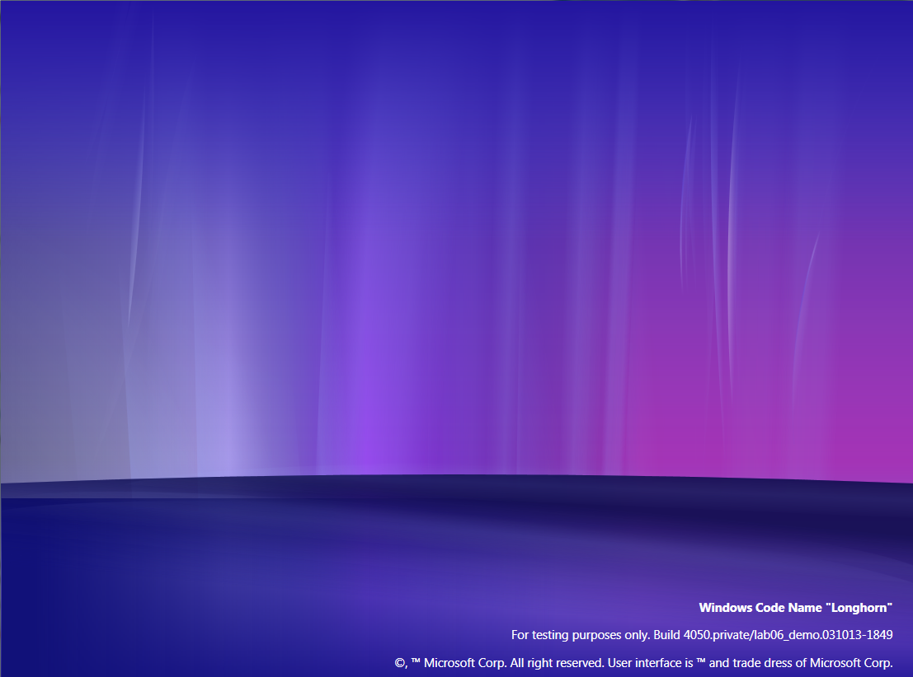

Aurora is one of the eye-candy features which is best represented in Milestone 7 builds. Using the powerful Avalon presentation engine, Longhorn was able to draw fancy animations, like Aurora, without any significant performance hit on the processor. Aurora in the preview panel was first shown at the PDC 2003 conference when a [private build was showcased](/guide/4050-xx). At first sight many people thought the demo was just a flash mock-up, but Hillel Cooperman was fast to debunk this. The particular demo shows us working WinFS, content-based thumbnails, Aero Glass and an animated aurora effect in the preview panel. Most of these features wouldn't be seen again until the next year at WinHEC 2004. Although the "WinHEC build", 4074, does have a working DWM engine, at first it looked like it didn't have any aurora at all.

But it did. The effect was found and applications were made to show what it would look like when working. Only some years ago a modded 4074 image was released under the name _The Way It Was Meant To Be_ (TWIWMTB) which added the fully working aurora effect to explorer. In the remainder of this article I will explain more about Aero and why the aurora which is available in build 4066 and 4074 doesn't work in the first place and how it works at all. Moreover, I will go one the steps needed to manually enable the Animated Preview Panel Aurora (APPA) in build 4074.

#### A theme with two faces

Part of the problem of aurora not working is that none of the default themes actually _supports_ aurora. Both Jade and Slate cannot draw the aurora on the preview panel. The only theme that is actually capable of drawing it is the Aero theme. I hear you think: "But there is no Aero theme installed by default". That's absolutely right, but really Jade IS the Aero theme in disguise. The Jade visual style file includes all resources for both Jade and Aero. During early Longhorn development the Aero theme was kept a good secret and remained off-limits even for most shell developers. To get access to the Aero msstyles file you needed permission from Scott Hanggie, who probably was in charge of the group developers implementing Aero. The Jade theme, however, was freely accessible and often used as a place holder for Aero. The Jade theme has far less attractive greenish borders when DWM is enabled in comparison with the fully transparent borders of the Aero theme.

To convert Jade to Aero you need to rename the theme files and edit the .theme file. If you wish to do so, you can follow this quick tutorial (this has already been done for you in the TWIWMTB version of 4074).

* Browse to `C:\Windows\Resources\Themes\` and copy the file jade.theme and the jade folder to another directory
* Rename jade.theme and jade.msstyles to respectively aero.theme and aero.msstyles. Rename the folder to aero too.
* Open the aero.theme with notepad or wordpad and change `DisplayName=@themeui.dll,-203` to `DisplayName=Aero`
* Next, replace the remaining two instances of the word _jade_ in the same file with _aero_ (use CTRL+H)
* Copy the newly created aero.theme and the aero folder back in the `C:\Windows\Resources\Themes\` directory

Applying the Aero theme will result in a completely new style. If you don't see the new task and sidebar, you might need to restart explorer.exe. Note that even though the new style task and sidebar are only enabled when the Aero theme is applied, they aren't part of the Aero theme itself, but a system library. They will only show once a "theme name check' has been passed.

Build 4066 is the first build where above described "Jade to Aero conversion" works. Aero is not exclusive to Milestone 7 builds though, the theme was already [referenced in much earlier builds such as 4033 and 4039](/4039-tips-tricks).

Note that converting Jade to Aero will not enable the transparent Aero Glass theme, but will show up using greenish borders. For 4074 and 4066 patched files exist to enable transparent window borders.

[DWM Aero theme for 4074](/download/dwm-aero-theme-for-4074.rar)

[Patched Desksrv for 4066](/download/patched-desksrv-for-4066.zip)

#### Checks

Since you just enabled the Aero theme, all internal checks for enabling aurora have been passed. Yet, there is still one thing preventing you from having the animated aurora in the preview panel. To understand this you will need to know that there is NO aurora in the explorer. The class that creates the aurora effect in explorer (System.Windows.Client.Shell.View.Aurora) does not have the aurora resources embedded. Instead it relies on an external memory stream coming from the theme file. This stream is then loaded as a BAML file and parsed to create the animation.

#### Broken {#fix}

The original Jade theme files in both build 4066 and 4074 do indeed include a resource that serves as memory stream. Opposed to what I earlier thought, the files are actually valid BAML files and do produce an aurora effect when properly loaded. The major problem is that the BAML file uses an, at the time, already deprecated format incompatible with the system's default BAML parser. The screen below shows the original BAML file from 4066's Jade theme loaded by an older parser.



Luckily, a BAML file using an updated format has since been found and is available for download below. To make the APPA work, simply replace resource 481 in the STREAM folder of the original Jade theme. In the download you will find a correct 481 resource file, a ready patched aero.msstyles and also a text dump of the BAML that provides the APPA.

[Aurora for vanilla 4074](/download/aurora-vanilla-4074.zip)

This package includes the transparent DWM theme by BOFH patched so that it has working APPA:

[4074 Transparent DWM + APPA](/download/4074-transparent-dwm-appa.zip)

#### Desktop aurora

Aurora in the preview panel isn't the only kind of aurora we know. In build 4066 and up a BAML file for desktop aurora can be found. Desktop aurora is what its name suggests; aurora as a desktop wallpaper. This implementation of aurora was probably introduced in build [4050 with build tag private/lab06_demo.031013-1849](/guide/4050-13) since this build's tag is included in the BAML file. One class for loading the desktop aurora can be found in Longhorn's system files. Sadly, while loading the BAML file Avalon will throw an error.

4066 is also the first build to have aurora as background when the 3D view option is enabled in explorer. The files that make up this aurora effect had been in Longhorn since the start of Milestone 4 and therefore this aurora is often called "Milestone 4 aurora'. It's noticable that this aurora is not rendered using the managed Avalon API, but consists of a set of PNG images rendered using DirectX. Below you see renders made using the original files found in build 4028 created with AssimpView.



####  Aurora as system assessment

Based on information from Robert Stein, a designer at the Longhorn UX team, we know there have been plans to use aurora as an element for system assessment tests. His website used to show a concept of what such aurora would look like and even a video showing this effect in motion.

> A real-time version of this was custom designed for the OOBE (Out Of Box Experience) during the first install. When the installer rates your systems hardware, to determine if it can handle the Glass display, it would use the real-time Aurora to throw data at the systems cpu and gpu while it also lets the user now that "something" is going on, and the system hasn't stalled.

No traces of this aurora are present in any pre-reset Longhorn builds. After the reset the system assessment tool, WinSAT, was introduced which quite noticeably uses various DirectX shader files dating from April 2004 which is still before the Longhorn project reset. Build 5219's WinSAT includes an aurora assessment remarkably similar to Robert Stein's concepts. If you'd like to have a look at this effect yourself, download the package below which includes WinSAT files from various builds. Note that by the time of build 5308, the fully DirectX rendered aurora was replaced by much less sophisticated moving PNG images with some DirectX light effects.

[WinSAT files](/download/winsat-files.zip)

