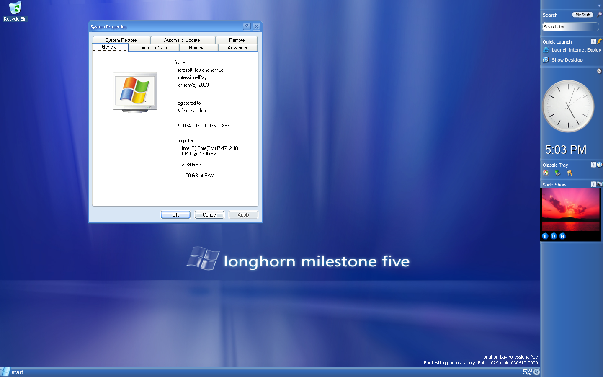

While exploring Longhorn builds you might have noticed these weird spelling mistakes in the Windows branding  like; "onghornLay rofessionalPay" and wondered whether one of the developers had a breakdown while typing this. In this article I will elaborate on the exact purpose of the "onghornLay" branding.

#### Backstory

Up until Longhorn, Microsoft had been creating Windows with hard-coded strings spread throughout the code. This would have not been a big deal if Microsoft planned on releasing only one Windows version with one language option, but it might begin to form a problem when your wish is to change Windows editions (or even the product name) on the fly during the Windows development process and add languages when needed. A good example of the former is Server 2003. Server 2003 was named ".NET server" until shortly before its launch. The last minute name change cost Microsoft a large sum of money since all hard-coded product name strings had to be found and replaced manually. It was clear a generalised location was needed in the operating system to store all these product names and SKUs.

#### eryVay rofessionalPay

A first attempt to eliminate all hard-coded strings was already made as early as Milestone 3. In build 3683 a branding API can already be found unseen in earlier Windows versions. System dialogs like winver that need to show some specific branding info (e.g. product name, SKU) simply make a call to the this API which answers with the requested string.

During Milestone 5, Lab06 created a new iteration of the branding API which was reverse integrated into the main branch in June 2003. When builds with this new version of the API first leaked, the beta scene was quick to label these build fake. To test the implementation and check whether a hard-coded string had been replaced correctly all reference strings were altered according to a set of rules called _Pig Latin_. This made for some silly branding in all of these builds: "indowsWay onghornLay rofessionalPay". It didn't look professional at all, but it is indeed a very simple way to verify that the string had been _replaced_ successfully. To clarify: each strings containing product information loaded via the new branding API would use the Pig Latin spelling unlike hard-coded strings that would retain their normal spelling. All Pig Latin strings were removed in Milestone 7.

