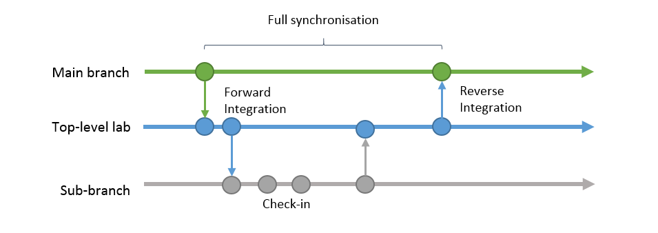

Ever looked at a Windows build list and wondered what all those different tags mean? Or did you ever wonder about the production process of Windows? If yes, you've just clicked the correct article. This article will elaborate on the Windows build process as used during the pre-reset Longhorn development. Please note that even though I've conducted rigorous research, not all information in this article may be accurate.

#### Virtual teams

Developing software can be hard. One of the factors that plays a role in good development is communication. When developer teams working on the same software application grow in size the overview of a project is easily lost and communicating is not going to be very easy. A solution to this problem could be to just reduce the numbers of people working on the application, but for an application as big and complex as Windows this is not going to work out. Because of the magnitude of Windows you want to have many people that work on different areas of the application.
  
Microsoft coped with the issue of many developers on a single project by cutting the large team into various smaller groups called virtual build labs. These virtual labs work individually on a certain area of the product, but do sync up with other groups every once in a while.

Virtual build labs seen during Longhorn development are:

  * Lab01: Base
  * Lab02: Networking
  * Lab03: Server
  * Lab04: Management
  * Lab06: Desktop
  * Lab07: IIS/COM+

Notice that there is no Lab05. This fifth lab is the "main branch". As you can see, each lab has a different function or task. Take for example the sixth lab, better known as the shell or desktop lab. This lab in particular is an interesting one since all of the user interface work comes from this lab. The labs above are not exclusive to Longhorn, but were already were not only seen during Longhorn development, but also during the development of Windows XP and Server 2003.

#### Source control

The source tree at Microsoft is managed in a way that can be best explained as SVN-like. Of course the way of pushing/pulling/merging that happens in software developing is not exclusive to SVN, but it's a convenient example to use here. Basically, every developer needs to enlist themselves to the source depot server. This server holds the complete Windows source for every lab. To get an idea of how the Windows source is stored in such a depot have a look at the leaked Windows NT4 or 2000 source.

#### Inside a lab

As said before, each lab has a complete copy of the Windows source code. A enlisted developer could reach the code by browsing to this desitnation of the source depot: `\\depot\private\Lab0X_DEV\[project name]\\[dev name].` Here X is the number of the lab. Work in a lab is split into multiple projects to which developers are assigned. These projects come with different files on the source depot server and often also have their own sub-branches inside the lab. For example, `private/Lab06_demo` might be a special sub-branch in Lab06. The branch for developers to test their own code changes in is `private/Lab0X_dev([dev name])`.  Note that, even though it is mandatory, Lab03 never included the "private/" part in any of their branches.

#### Private building, checked & checking

As you might have noticed there's something private going on in those branches and the source depot. This has nothing to do with privacy or so, but it's about building private binaries. Every developer can choose to check-out source files from one of the enlisted branches. These files will be synced to the machine the developer is enlisted to. Typically, a developer would work on the source of the checked-out files and when ready, compile these files to test them.

Private in this context more or less means that the source code for the files was changed by a developers and is different from the source found in the source depot: the changes made are not publicly available. Privately built builds are commonly of the "checked" flavour. After testing the privately build files, the private source will have to be merged with the current source in the source depot (note that the source might have been changed over time and potential merge conflicts have to be resolved). After another successful test, the source is now ready to be checked-in into the project branch's source code. Each project would again Forward-Integrate (FI) its changes into the top-level lab. Once a feature was FI'd into the top-level lab the probability of it being included when FI'ing the lab's source into the main branch  was very high.

#### _More:_ Checked builds

Checked builds are build that have certain debug info pre-installed and still contain debug assertions. Checked builds are not suited for normal consumer usage since they run slower than their "free" counterparts and handle errors in a different way. Checked builds can be easily made out from their image name which will include CHK instead of FRE.

#### Syncing up

At some point all changes checked-in into a lab by its developers will have to synced with all other labs. The process of doing this is called reverse-integration (RI). A few weeks before a planned RI, a lab will typically "snap". Snapping means that all developers need to check-in their code and no newly written code is accepted. Special branches for snapping are available such as `snap_dev_ux`  for Lab06. After the snapping deadline work will begin on creating a build with as many bugs resolved as possible . This build is sometimes called an RI-candidate. When RI'ing, the lab's source code is merged with the so called main branch. The main branch is supposed to always have a stable version of the source with as few bugs as possible.  The rule of thumb is that the only builds that ever go external are builds from the main branch (or branched off of it). After testing the main build, the source is then forward-integrated into all other labs again, so everylab is on the same page.

A full synchronisation of a lab could take as long as one complete milestone. Because of the rather slow syncing a lab could drift very far from what was happening in the main branch. Please note that the schematics on this page show the main branch interacting with only one lab, which has only one sub-branch. In reality there are multiple labs and each of these labs would have multiple sub-branches.

#### N-labs

Most labs, if not all have a "\_n" counterpart. The function of these labs is to act like a buffer between the top-level lab and the main branch. Because in some labs so much new features were RI'd into the top-level lab so fast by the sub-branches it became impossible to timely test how all these features behaved when added together. The goal of the n-lab was to slowly add features and thus merge all changes from the top-level lab with the changes FI'd from the main branch and the other way round. A \_n lab would make more code flow possible between the top-level lab and main branch, but still a full code synchronisation of the toplevel-lab and the main branch would only happen approximately once every milestone.

#### Branching off

For special occasions the main branch can branch off into a different branch to prepare for a special release. Such a release can be something like a RTM, RC, beta etc. Branched off builds that were seen a few times during Longhorn development are of the IDx flavour. IDx is the collective term for both IDS and IDW meaning "Internal Development Server / Workstation". These builds are expected to reach a certain quality and usability standard. Builds from the IDx branch are given to TAP (Technology Adoption Program) and OEM (Official Equipment Manufacturer) partners. Two of them were also given to attendees at PDC 2003 (4051) and WinHEC 2004 (4074).