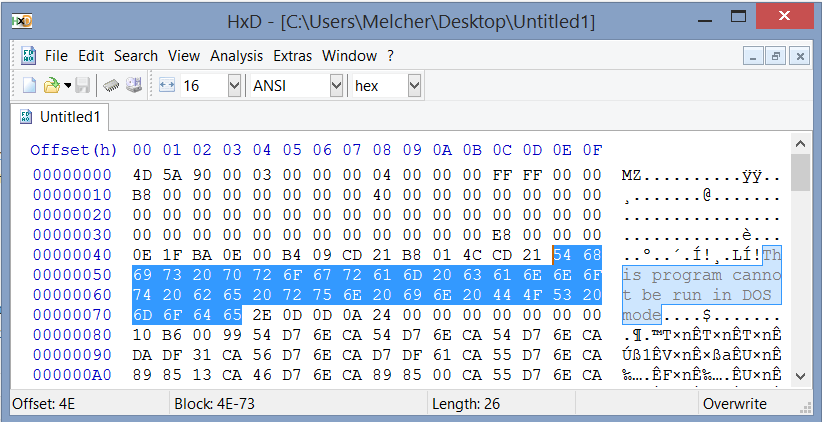

This quick introduction to hex was originally to be part of another article, but became quite long and therefore I decided to separate it. Even though it doesn't have anything to do with Longhorn in particular I believe it will be worth the read.

####  A bit of binary to begin with

At its core, a computer can only distinguish between two values. A value is either high or low, 1 or 0. This means a single digit is binary (can take two values). Often when handling a binary digit it's simply called "bit". Not many interesting calculations can be carried out using only 1 and 0. To enable computers to perform calculations like in mathematics a special "encoding scheme" is needed to map numbers to various orderings of 1's and 0's.

An example of a binary value can be 110100. To calculate a decimal number from the given value, start at the rightmost bit and multiply it by 2^n where n is the place of the bit. Next, do the same calculation for the bit directly left to it and continue doing this until no bits are left. Finally, sum all the answers. Here is an example:

```
2^1*0 = 0
2^2*0 = 0
2^3*1 = 4
2^4*0 = 0
2^5*1 = 16
2^6*1 = 32
---------- +
52
```

It's good to know different amounts of bits have different names. For example, four bits are called a "nibble" and eight bits are referred to as one byte. Byte really is the starting point of all other multitudes of data we know: Kibibyte (2^10 bytes), Mebibyte (2^20 bytes), Gibibyte 2^30 bytes) etc. Note the usage of multitudes described by [IEEE 1541 guideline](https://en.wikipedia.org/wiki/IEEE_1541-2002) instead of SI prefixes (Kilo, Mega, Giga and so on). As you might realize, it's a pain to write large numbers down in binary notation. A solution to this problem is the hexadecimal notation which will be discussed in the next few paragraphs.

#### Just like your decimal numeral system

Hexadecimal notation or hex for short, is a notation to simplify reading binary data. Each hex digit can have 16 different values. The value ranges from 0 through 9 and A through F. The characters A, B, C, D, E, F represent numeric values 10 through 15 respectively. Fundamentally the hexadecimal numeral system has a lot in common with the more generally known decimal numeral system. Like decimal numeral system, hex is a positional numeral system. The difference lies in the "base': where decimal uses base-10, hex uses base-16. To illustrate how this works in practice, I have worked out some examples.

Decimal notation of 256:
```
2*10^2 + 5*10^1 + 6*10^0
```

It's not very difficult to see the above is true. Because we are so used to counting base-10 it all seems very natural. The same number would be calculated base-16 this way:
```
1*16^2 + 0*16^1 + 0*16^0
```

To distinguish between decimal and hexadecimal notation often 0x is added when hexadecimal values are treated. This results in the above value being written as 0x100.

Another example for 123:
```
7*16^1 + B*16^0
```

It's obvious how 7\*16 can be calculated. It's, however, less intuitive how one can calculate B\*16^0. As pointed out in the first paragraph, hex uses A through F to denote values 10 trough 15. In this case B is actually a number! Substituting 11 for B will result in 11\*16^0 which is, again, easy to calculate. The final sum:

```
7*16 = 112
11*1 = 11
---------- +
123
```

Indeed, 0x7B equals 123.

#### Hex editors

When using a hex editor like HxD hex digits are mostly grouped two by two; this is not a coincidence. A single hex digit can at most be 15, namely value 0xF. 15 written in binary form is 1111. Four bits, called a "nibble", form exactly half a byte data. This means that two hex digits form exactly one byte or eight bits of data. As many will understand, this significantly decreases the amount of digits needed to be written down: each eight bits will only need two hex digits.

####  Reading an offset

To be able to find certain parts of data in a file some notion of offsets is required. In short, an offset indicates where a certain part of data in a file begins and consists of both a row and column. Offset 0x1F denotes the last column (16) of row 2 (because numbering starts at 0). Likewise, offset 0xFF denotes the last column of row F.

The hex editor below shows a selection made in a PE header starting in at offset 0x4E with a length of 0x26 bytes. The block selected reaches from offset 0x4E to 0x73. The offset of the next value after the selection (value 2E) is 0x74.



As seen in the image above, hexadecimal values are represented as ANSI encoded characters in a separate column next to the data. When values represent plain text it can immediately be read.

#### Endianness

Endianness describes the order in which bytes are written down. Using decimal notation, the most significant number is always written first (big-endian). It's, however, common to have the least significant bit upfront (little-endian) in data files. In a little-endian formatted data file, a saved offset of two bytes long might read '24 1D'. Since it's written down little-endian the most significant byte is the last one and the actual offset will therefore be 0x1D24.