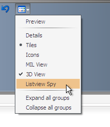
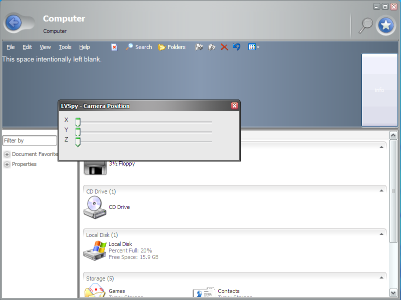

Most of you will probably be aware of some of the hidden view options available throughout the Longhorn builds. These views are commonly known as "Carousel" and "Panorama". The latter is often also called "Phodeo". Enabling the 3D view-mode as well as one of these hidden views causes a DirectX rendered view to appear instead of the familiar plain 2D view. The DirectX powered view features all sorts of animation to spice up the browsing experience.

Besides the hidden views mentioned above, a third view can be enabled: `LVSpy`. But, what does this view do, if anything?


Windows Registry Editor Version 5.00

[HKEY_LOCAL_MACHINE\SOFTWARE\Microsoft\Windows\CurrentVersion\Explorer]
"Carousel"=dword:00000001
"LVSpy"=dword:00000001
"Panorama"=dword:00000001


Enabling LVSpy will enable an additional view mode in the views menu. Notice the label of the extra item in the menu "Listview Spy".

Listview is the name used to describe the panel that showing you all your files and folders. It seems that Listview Spy is not a regular view-mode, but some sort of developer tool giving insight in the current camera position of the listview. For a long time I've been wondering what valuable information is captured in the listview worth spying for.

The LVSpy dialog only opens when either the MIL or 3D view was selected first. After opening the dialog it cannot be closed. The only way to close the window is closing the explorer window it belongs to. Opening LVSpy when no Direct 3D capable driver is installed is pretty useless and will result in all sliders set to their default position (like in the image below). This behavior can be explained by the fact that, because of the lack of DirectX support, explorer won't attempt to draw the 3D viewing mode. Therefore no viewbox is available to read X, Y and Z values from.

When DirectX support is available LVSpy shows the current values of the viewbox. These values directly depend on the size of the window itself.



Contrary to what I first thought, the sliders are not meant to be adjusted. Changing the sliders will not change the viewbox co-ordinates. So, that's it. Listview Spy is a dialog that let's one check the current co-ordinates of the DirectX rendered 3D view. This was probably used as a quick debugging tool to quickly check the behavior of the newly introduced views.

Thanks to [yourepicfailure](https://www.betaarchive.com/forum/viewtopic.php?f=62&t=36131 "BetaArchive Longhorn 4066 ListviewSpy").