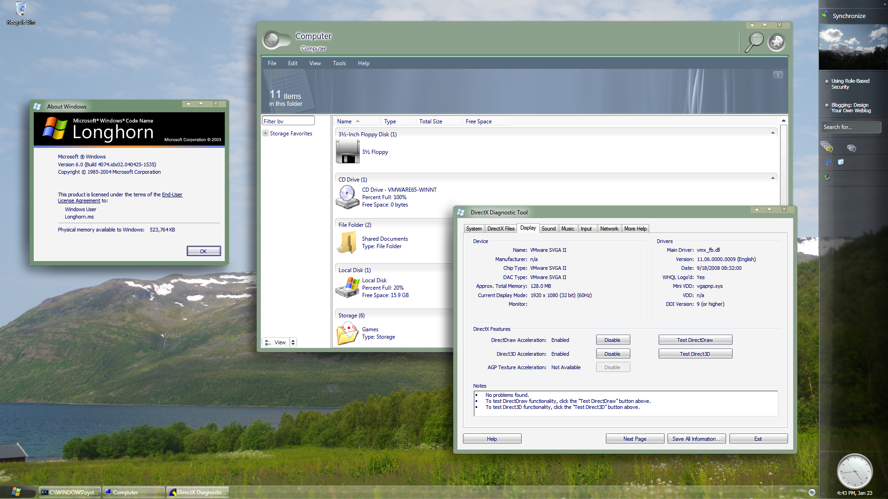

For your convenience, I uploaded a pre-configured Longhorn VM for you to download!

The VM contains a vanilla 4074 installation with the following bits changed:

  * created Aero theme and patched APPA
  * installed correct base-system drivers (6.5)
  * installed DWM compatible graphics driver (6.5)
  * enabled MILExplorer in registry
  * removed 180 day evaluation restriction

Note that the VM was created in VMware Workstation 7.1.4 and should also be used with that version of VMware. **When restarting the VM it probably wants to active right away. Be sure to start into some WinPE environment so you can apply the [winlogon crack](/activation-cracks).**

Once unpacked, the VM is 5.59 gigabytes in size. Note that the VM was created on a computer with a 4th generation core i5. Processors with feature-set vastly different from this may not work well with this VM.

Please let me know whether or not the VM works for you.

 [Download](/images/4074vm.zip) 1,77 GB (1.907.253.350 bytes)
  
(please do not directly link to the download. Link to this page instead)