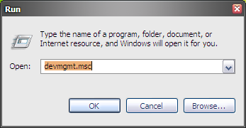
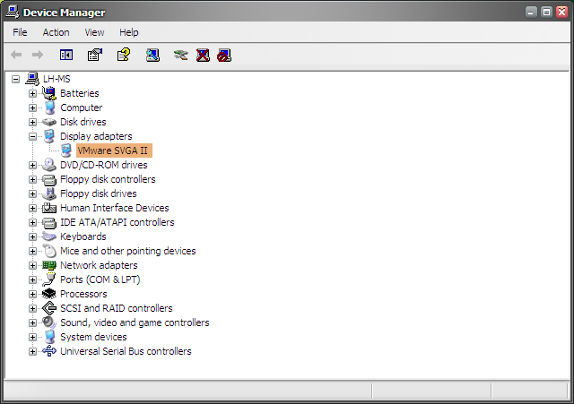
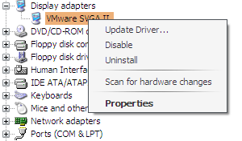
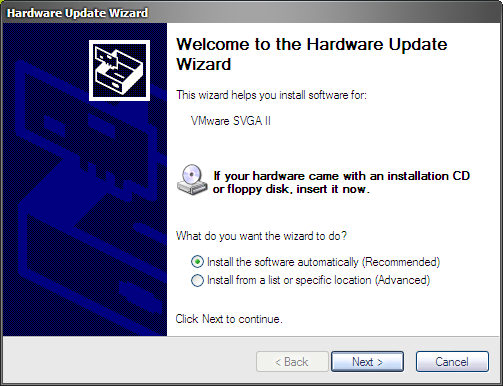

When using Longhorn it's a must to known how to manually install drivers in Windows. The process is basically the same in all versions of Windows, but I thought it couldn't hurt if I would write up a short tutorial for those people new to installing drivers.

We start off by opening _Run_ by pressing WIN + R . In the dialog, type `devmgmt.msc`

Click _OK_. The _Device Manager _will now open up. Next, expand the item that you want to install the driver off. Items which have currently no driver install will show up as a yellow question mark. In this case I will install a new driver for the display adapter, so I expanded this item.

Right click the device and select _Install Driver _if none was installed or _Update Driver_ if you wish to update an existing one.

Be sure to insert you driver disk right now! Below are a couple of VMWare driver packages that can be mounted to a disk on your VM.

* [VMware 6.5 driver package](/download/vmware-6-5-driver-package.zip)
* [VMware 6.5.2 driver package](/download/vmware-6-5-2-driver-package.zip)
* [VMware 7.0 driver package](/download/vmware-7-0-driver-package.zip)

You can now let the _Hardware Wizard_ install the driver for you by selecting the first option. In case you want to further specify where your driver is located you can choose the second option.

Upon click Next, the driver installation will commence. At this point, Windows might throw some error dialogs your way. You can just ignore these and continue the driver installation.  A few examples of errors you may encounter are below.



By now, your driver should be installed! I hope this quick tutorial helped you out.