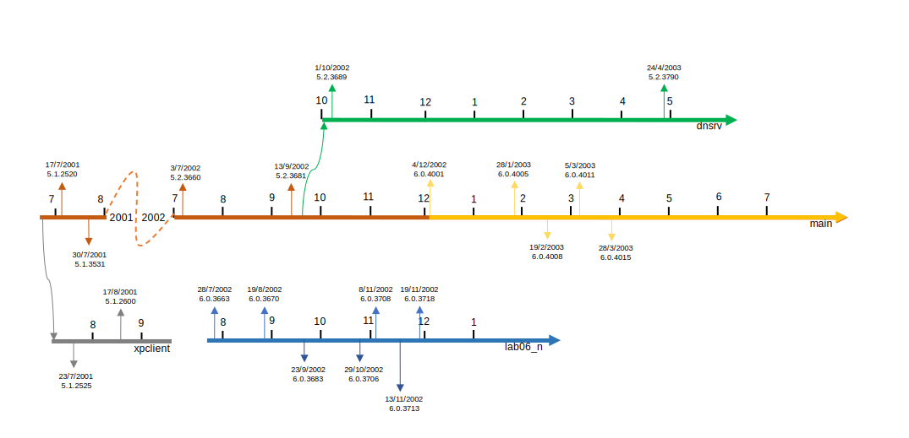

Often times people are confused to hear Longhorn was based off of Windows Server 2003. To the newcomer it seems more plausible that it was instead based off of Windows XP because early builds look so much like it. In this post we will have an in-depth look at the early beginning of the Longhorn project. Along the way we will discover how Longhorn emerged from the Server 2003 code base.

##### Note that the names Server 2003 and .NET Server are used interchangeably.

#### Trunk based development

Before we begin, it's good to know something about how Windows is developed. When developing a large software application there are various ways to separate the developmental code from the release code. One of these ways is trunk based development. Using trunk based development there is one clearly distinguishable shared branch all developers commit their code changes to. This one branch is called  the "trunk".  For Windows this trunk is better known as the [_main_ branch](/builds/branch/main). The trunk is in continuous development and over time Windows versions are released from the trunk's code base.

Whenever a product is due to be released a _release branch_ is forked from the trunk. A release branch is maintained as long as the product is supported. When critical updates are available for the trunk usually these will also be released in some form for release branches affected by the same problems. This way the release branches will more or less stay in synch with the trunk. Eventually, when the product is being phased out and reaches the end-of-life (EOL) status, the branch will be abandoned.

Note that release branches can be seen as trunks on their own as well. Long lasting product release branches may have branches forked from them and may be actively developed. For example, the _dnsrv_ branch was forked from the trunk in late 2002. This branch was not a direct product release branch, but rather a special branch for the Windows server product whereas _main_ was reserved for Windows client. Moreover, a release branch may have separate branches for large scale updates such as service packs (e.g. _xpsp1_ for _xpclient_).

The figure below shows an overview of the _main_ trunk and release branches from 2001-2004.

Be sure to check out [WinSuperSite](http://winsupersite.com/windows-server/windows-server-2003-road-gold-part-two-developing-windows) to read more about trunk based development.

#### Branches in detail

To create a better understanding of how Longhorn precisely emerged from the Whistler and .NET Server trunks, I put together a detailed figure showing the most important Windows development branches starting from July 2001. The upwards arrows on the timeline represent builds compiled in the corresponding branch. To save space I omitted September 2001 through June 2002.

In 2001, somewhere between 17 and 23 July the main branch was forked to the _xpclient_ release branch. This branch was dedicated to the Windows client, Whistler - which eventually became XP. The main branch continued to compile the server counterpart of Windows. To avoid confusion between client and server, the build number for the main branch was incremented with 1000. As of that moment the main branch began compiling builds in the 3000-range.

The first Longhorn build confirmed to exist is [3663](/builds/3663) compiled by [_lab06\_n_](/builds/branch/lab06/lab06_n). There are, however, indications that Longhorn builds were already being compiled as early as 2001.

Exhibits from the Microsoft v.s. Comes case give a unique insight in some of the earliest development and planning of Longhorn. According to document _[PX06977](PX06977.pdf)_, planning for Longhorn was supposed to start in either July or August 2001. The passage below originates from internal Microsoft correspondence dating back to December 2001.

> Introducing the ability to search for files into the places where people need it. An obvious example of this is the File Open dialog. **This is implemented today in longhorn but there’s no UI**. Our team could help with the UI/code needed to make this accessible (&#8230;)

> _Anti-trust case document [PX08378](PX08378.pdf)_

To put this into perspective, if Longhorn builds were indeed already compiling in December 2001, it's very likely for Longhorn builds in the 3500-range to be in existence. Steven Sinofsky also briefly mentions Longhorn in a mail dating 6 February 2002. This substantiates the existence of Longhorn builds way before the earliest known build at this time, 3663.

> (&#8230;) it is worth noting that even without this work it had been becoming clear that the server was stretching. This was causing pressure on WinXP SP1, which was expanding in scope (meaning it would take more and more of testing to get it done, **which means they would not be testing Longhorn.**)

> _Anti-trust case document [PX07069](PX07069.pdf)_

#### Where it all started

It is assumed that work on Longhorn was started in the lab06 branch which is responsible for the shell. Up to the compilation of build 4001, Longhorn and server both continued in the 3000-range. The only indicator of any difference was a jump of the kernel number from 5.2 to 6.0. At this point in time Longhorn and Server were still closely intertwined. As such, lab06 still reverse integrated any updates and bug fixes from the main branch to Longhorn. This probably continued even after the server trunk was forked to its own branch, _dnsrv_, somewhere between 13 September and 1 October.

Two months later main branch starts the compilation of Longhorn builds. Again, to clearly distinguish Longhorn from other trunks, the build number jumps 1000 this time ending up in the 4000-range. It is unknown whether any builds were compiled from the main branch in the two months between the forking of Server to _dnsrv_ and the first compilation of Longhorn builds.