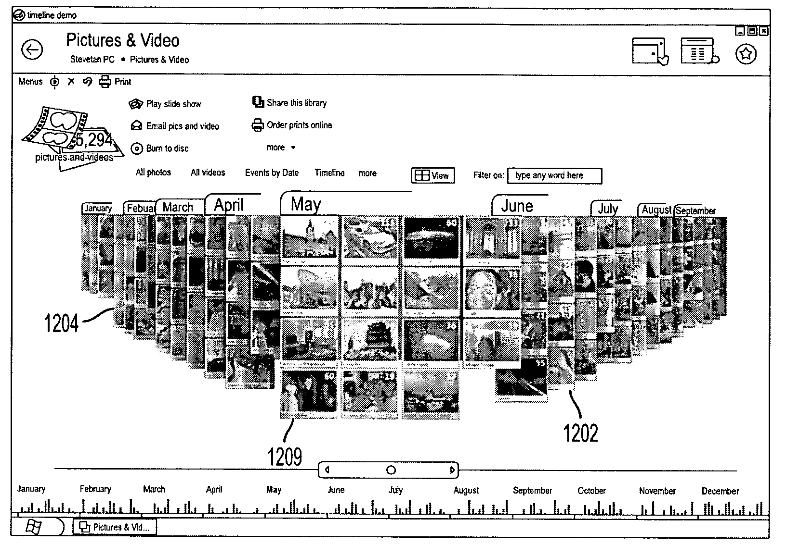

Multiple patents were filed by Microsoft for this sensational effect. One of the patents shows some detailed screens of what Phodeo is supposed to look like. These images closely resemble some of the concepts shown by Hillel Cooperman at PDC '03, but are, in fact, not the same. Where the user in Hillel's demo was Jim, the user in this concept is called Steven. Also note that in the image below the window frame is visible, clearly identifying this as a mock-up created in Macromedia Director with the title "timeline demo'.

