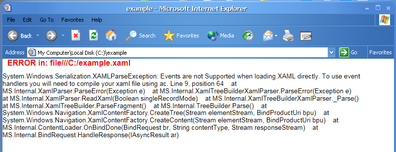

In this third part of the Hacking Avalon series we are taking a closer look at the process of making an Avalon application. To do this, we will be using a special tool only available in early Longhorn builds. This tool is called the Avalon Compiler or simply "ac'. This tool does what its name suggests; compile Avalon. But what is that precisely?

  * just a quick note before we begin; this post is completely based on the Avalon version included with 3683. Though many of the concepts explained here hold for later builds too, some may not be applicable to later versions of Avalon.

#### The basics of XAML

Avalon introduces a mark-up language called eXtensible Application Mark-up Language or XAML for short (pronounced _zaml_). Using xaml it's easy to quickly create a complete user interface. Xaml is xml formatted and therefore easy to learn for developers already familiar with html or other xml based languages. Each element in the mark-up corresponds with an Avalon object in the .NET runtime. On its turn each attribute of an element corresponds to a property of that object. Here is a snippet of mark-up.


<FlowPanel xmlns="using:System;System.Windows;System.Windows.Controls" Background="LightBlue">
  <Button Height="100px">Clicky</Button>
  <TextPanel Foreground="White" FontFamily="Trebuchet MS" FontSize="72pt">Hello, world!</TextPanel>
</FlowPanel>


Saving this as a file with the xaml extension will create an executable "Avalon Application'. The built-in Avalon Shell Handler can load the file directly and will happily draw the interface defined in the mark-up. It will do so in an Internet Explorer window. The example mark-up above will yield the following result:

Note that, we used nothing but mark-up to define this little "program'. We even defined a button. At the moment nothing happens when the button is clicked. This is of course all good and well, but what if we want our users to be able to interact with the interface? The next thing we will do is to add a click event to the button.

#### Adding code

To add event handlers to your interface you need to supply some extra information in the mark-up. First, we add an extra xml  namespace "Definition" and declare the language we are planning on using (C#). Next, all you need to do is to add the corresponding triggers to your mark-up and create an Code element to hold your code. Code is wrapped in a character date (CDATA) section so that it will not be interpret by the xaml parser. Here is the mark-up with a button click handler added.


<FlowPanel xmlns="using:System;System.Windows;System.Windows.Controls" xmlns:def="Definition" def:Language="C#" Background="LightBlue">
  <Button Height="100px" Click="handleClick">Clicky</Button>
  <TextPanel Foreground="White" FontFamily="Trebuchet MS" FontSize="72pt" ID="TextArea">Hello, world!</TextPanel>
  <def:Code>
  <![CDATA[
    void handleClick(Element el, ClickEventArgs args) {
      TextArea.Nodes.Add("Button clicked");
    }
  ]]>
  </def:Code>
</FlowPanel>


Even though the above mark-up is valid, directly running the file will result in an exception being thrown by Avalon's xaml parser. "To use event handlers you will need to compile your xaml file using ac." This is where the Avalon Compiler comes into play.

#### Compiling mark-up

The Avalon Compiler is a powerful tool that let's compile mark-up to code or a binary formatted variant of xaml, better known as baml. Using the compiler from the command line is quite simple. From a command prompt window perform these tasks:

  * browse to C:\Windows\Microsoft.NET\Avalon\
  * execute `ac [path to xaml file] -out:[output directory]`

An example ac session, compiling the example.xaml file.

The compiler will spit out a couple of different files by default.

**exampleApp.exe** A secure stub executor, nicknamed "themepark". This is an unmanaged Avalon application bootstrapper which can start the application in a safe manner.

**example.baml** A binary serialized version of your original mark-up.

**exampleApp.dll** Application initializer providing a "SecureEntry".

**example.dll** Contains a partial version of the FlowPanel element including the button's event handler along with some helper functions.

Alternatively, using one of the different switches ac supports, it's possible to generate debug or "full code" binaries. Full code compilation will omit creation of a baml file and instead compiles all mark-up to code in a single dll. You can download the example files and the binaries here.

[Example mark-up files and binaries](/download/example-mark-up-files-and-binaries.zip)

#### The final result

Executing the exampleApp executable will open your Avalon application in a dedicated window. All event handlers are now properly working as expected.



We have now created our own simple Avalon application! The Avalon Compiler can also build more advanced applications. Complete Avalon projects can be created and compiled using _Longhorn Project_ files. We will explore the possibilities of these files in the next part of Hacking Avalon. Stay put!

**Addition** When some people found the Avalon Compiler executable still lingering in later builds (such as 4051) they started using this to compile their XAML to BAML. Since by that time a [major rearchitecturing had taken place](http://www.osbetaarchive.net/topic/83-the-two-versions-of-avalon/ "Melcher, OSBetaArchive - Two versions of Avalon") AC was long deprecated. Microsoft employee [Rob Relyea told them to use the new compiler _XamlC_](http://web.archive.org/web/20040625114600/http://weblogs.asp.net/jnadal/archive/2003/11/17/38124.aspx "Jason Nadal - Manually Compile your XAML into BAML") instead which is included in the Longhorn SDK given out at PDC 2003.