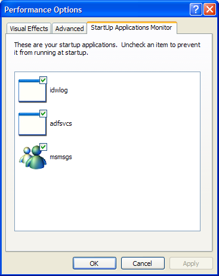
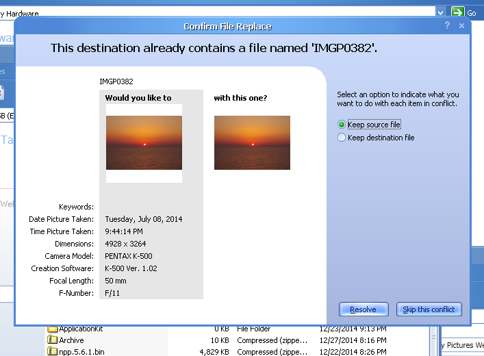
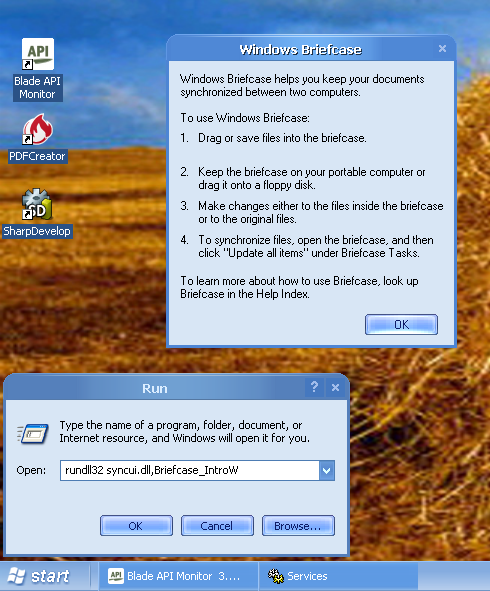
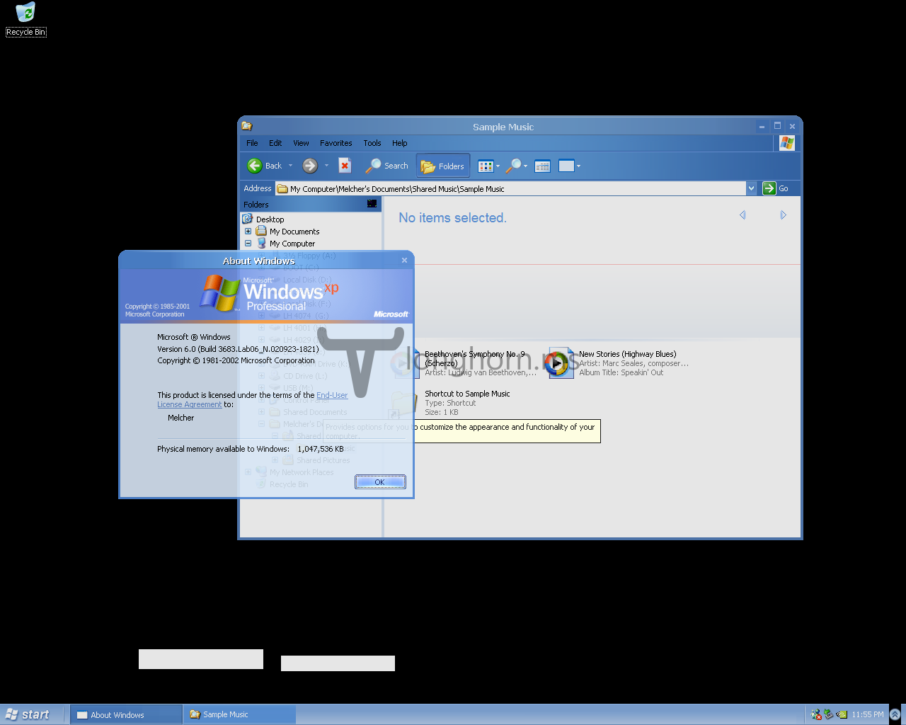

Longhorn build 3683 is the "youngest' of all Longhorn builds we have access to, dating back to September 2002. As such you might expect it to be very similar to XP and Server 2003 versions of Windows. When looking superficially at this build this may seem to be correct, but for those that care to take a closer look there are plenty of new features to be found throughout this build. Moreover, when taking a look under the hood, it becomes apparent that technologies like desktop compositing and WinFS had already largely been implemented by this time. On this page I'll point out some of the often missed/forgotten features present in this build.

### WinFS and virtual folders

WinFS, in contrast to later builds, indexes the complete root drive of the computer. Because of consistent performance issues, later builds only index small parts of the drive. Though implemented, virtual folders still lack in functionality. Various pivots are available making it easy to find the files you are looking for. All files in a virtual folder show a file size of 0 bytes.

### StartUp Applications Monitor

Even though this feature was already available through another tool - _msconfig_ - this is a more user friendly way of presenting applications that automatically start with Windows. This tab is found in Performance settings in System Properties.

### Albums & playlists

It is possible to create collections of pictures or songs by creating an album or playlist respectively. After creation the album/playlist is rather useless. Opening a created album will result in the playlist dialog appearing, showing your pictures as songs. There is no possibility to actually play songs from a created playlist.



### Ratings

Music files in a virtual folder can be rated 0 trough 5 stars.



### New buttons in toolbar

A couple of new buttons can be found in this build that can be added to the toolbar.

From left to right you see the following options:

**Zoom**

Customise your viewing experience by selecting a size for items in the list view.

**Details pane**

Show or hide the new Avalon details pane on top of the classic list view. The details pane can show quick file information and a preview of the selected file.

**Pivots**

Lists various sorting modes for the current folder supported and driven by WinFS.

### Open file dialog

A restyled version of the open file dialog is present. The new dialog presents some newly implemented explorer features to the user such as pivots and zooming.



### File copy resolver

Whenever `NewResolve` is enabled this dialog will pop-up when copying a file to a location in which a file with the same name already exists. Its style reminds a bit of an earlier Microsoft project; Neptune. This feature is unique in that it is one of only a few things NOT implemented in Avalon which might mean it was a rather early addition to Longhorn.


Windows Registry Editor Version 5.00

[HKEY_CURRENT_USER\Software\Microsoft\Windows\CurrentVersion\Explorer]
"NewResolve"=dword:00000001


### Briefcase introduction

A detailed introduction dialog was added for working with briefcases. This little dialog can be invoked by running `rundll32 syncui.dll,Briefcase_IntroW`

### Branding API

Sniffing API calls revealed that system dialogs are using an all new branding API exported by Kernel32.dll. Dialogs like `sysdm.cpl` use this API to obtain branding information like the SKU and version. Using the `GetOSProductNameW` function one is able to obtain the following information. The argument of the function is a 7-bit long binary value. This value functions as a bit-mask, enabling/disabling certain parts of the branding information.

  * Company name - _Microsoft_
  * Product name  - _Windows_
  * Product revision - _Longhorn XP_ 
  * Stock Keeping Unit - _Professional_
  * Blank -
  * Version - _Version 2003_
  * Copyright - _Copyright c 1981-2003 Microsoft Corporation_

The binary value 1111111 (that's 127 in decimal) will yield the complete branding string of all the above info concatenated.

The application below uses P/Invoke to call the new function with decimals as argument.

This application is available on GitHub right [here](https://github.com/longhornms/GetOSProductName-3683)

The default screensaver in this build, `logon.scr`, has been altered to take advantage of the branding API and uses one of its functions to load the appropriate branding bitmap.

### Game Definition files

In preparation for a Game explorer, the _Game Definition File_ (GDF) format was introduced. Game definitions are an extension of the _Application Definition File_ (ADF) format used by WinFS to represent legacy (read pre-longhorn) applications. GDF files are backed by managed code providing extra functionality such as the (un)blocking and updating of games. There is even a news reader to get the latest game related news for a specific game. At the time of this build this feature was seemingly in a very early state; online resources are hardcoded to internal shares and database schemes are simply missing.

Although incomplete and mostly unusable, the GDF file type itself is picked-up by explorer.



Download your own copy of our little "game" here.

[ResetHorn - The Game](/download/resethorn-the-game.zip)

###  Desktop Compositing

Although very buggy, this build too sports the new desktop compositing engine. So far I have only been able to get this working on real hardware - it simply refuses to start in any VM configuration. Upon enabling DCE the desktop wallpaper disappeared.

#### Thanks to JaGoTu for (re)discovering some neat features in this build.