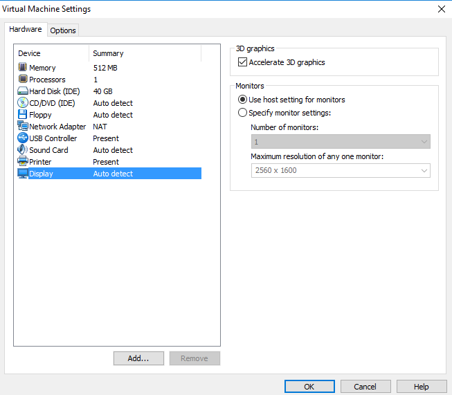
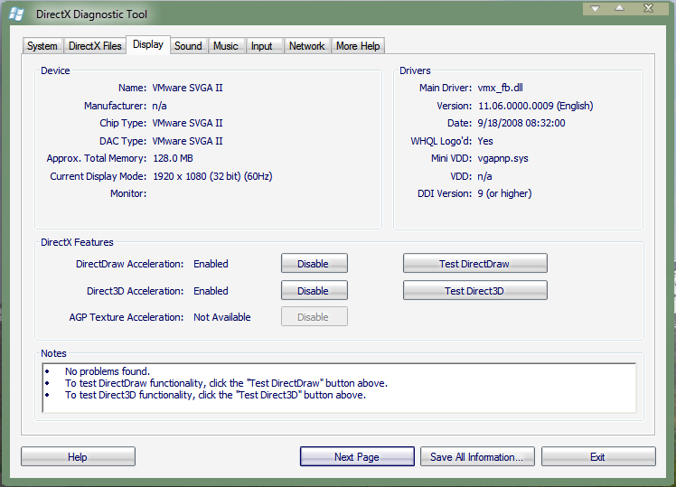

In this tutorial you will find everything you need to enable desktop compositing on the Longhorn builds that support it.

I'd like to note that I am writing this tutorial with VMware workstation in mind. As such, all drivers provided on this page are meant for use with VMware. At the bottom of this page you’ll find a list of builds that have working desktop compositing. For each of these build I will list the combination of VMware version and display driver that worked for me. Note that it’s very well possible that other combination work out for you. Feel free to share any combinations not listed on this page in the comments section! If you cam here looking for drivers, they can be found [at the very bottom of this page](#drivers).

## Hardware

In the case you have some old Longhorn-era hardware it worth the effort to try and get desktop compositing working. For some builds desktop compositing may even work out of the box. Your computer should at least have a graphics card with Pixel shader 2.0 and DirectX 9 support. Moreover, there should be Windows XP drivers available for it. You may need to install the driver package in Windows XP compatibility mode (right click > properties > compatibility).

Personal experience shows that the following graphic cards work very well with Longhorn and do allow desktop compositing.

* Nvidia FX5200
* Nvidia GT6600
* ATI Radeon 9700

For both Nvidia cards driver I recommend driver version 61.77.

## Checklist

There are a couple of things we need to make sure are supported and working before desktop compositing will work. These are the two things we want to have working.

* Full hardware acceleration
* DirectX feature support

Even when the hardware supports the above points the driver may limit these features. This is why it’s very important to have the right driver installed. To make matters more complicated, when virtualizing, the version of the hypervisor may also influence if desktop compositing works at all.

## Accelerate 3D graphics

Your virtual machine will need to be off to change this setting. Go to the settings of the machine and under Display check the box to accelerate 3D graphics.



<!--This information is over-simplified. I'll try to re-write this part to make it more clear why a compositing window manager is so unique.-->

## Installing the driver

From the list at the bottom of this page pick a combination of VMware version and display driver version. Most of the time display driver 6.5.2 will work on any VMware version just fine. Have trouble installing the driver? [See this guide.](/installing-drivers)</span>

<!-- Sources: WPF Architecture - http://msdn.microsoft.com/en-us/library/ms750441(v=vs.110).aspx The blinking lights division - http://web.archive.org/web/20040609085505/http://msdn.microsoft.com/longhorn/default.aspx?pull=/library/en-us/dnavalon/html/avalon03262004.asp WPF - http://en.wikipedia.org/wiki/Windows_Presentation_Foundation DWM - http://en.wikipedia.org/wiki/Desktop_Window_Manager cwm - http://en.wikipedia.org/wiki/Compositing_window_manager MIL patent - https://www.google.com/patents/US7511718 DCE patent - https://www.google.com/patents/US20050088447 WPF (green) - http://tutorial.programming4.us/windows_xp/Windows-Presentation-Foundation-in-_NET-4---Introducing-WPF---The-Architecture-of-WPF.aspx -->

## Enabling hardware acceleration

In client builds this is often on by default and you don’t need to set this yourself. In build with a Server SKU however, you need to set this by hand.

Right click on the desktop > Properties > Settings > Advanced > Troubleshoot

Move the slider completely to the right (Full). This enables full hardware acceleration.

## Checking DirectX features

If you followed above steps correctly (and the display driver supports it) and Longhorn plays along nicely you should now have support for DirectDraw and Direct3D. Whether these two features are supported and enabled can be checked in the DirectX diagnostic tool. Open Run (Win + R) and type `dxdiag`. On the Display tab you will find the current status of all DirectX features. It should look something like below:



Note that both DirectDraw and Direct3D are supported and enabled using the Vmware .5.2 display driver (SVGA II 11.06). The Notes section will show detailed descriptions whenever there are problems with the current driver.

If one of the two features cannot be enabled, something is wrong. You might want to try installing another driver or another VMware version altogether.

## Desktop compositing in general

Desktop compositing is a special type of window manager. A window manager manages the windows that you see on your screen. What's unique about a compositing window manager is in the fact that it provides a buffer for each application visuals. Once the window manager receives drawing information from an application, it draws this information to a buffer. The window manager then composites all buffer information into an image which is displayed on your screen. Since the compositing window manager has access to all image information on the system it's extremely easy to add (3D) effects to all applications on the system. Because every application's buffer is constantly updated, even when not directly in sight, it's possible to show live-preview images in other applications. A good example of the latter are the live tool-tips as seen in Vista and later. The actual image is drawn by an unmanaged compositor, the Media integration Layer (MIL). MIL is also used to draw Avalon/WPF applications and therefore is sometimes also referred to as a Unified Compositing Engine (UCE). All windows to be rendered are represented as composition nodes in a composition tree. To deal with the visibility problem, windows are drawn from back to front. This way the windows in the back will be overlapped by the windows in front of it. This procedure is also known as the painter's algorithm and makes it so effects like transparency are easier to achieve. All rendering done by the MIL is hardware accelerated using the computer's GPU through DirectX. By caching the composition tree which includes all windows and the desktop ("the scene"), MIL can provide a retained mode. When a window moves or is resized, the scene is changed and MIL will redraw and refresh the display in the next render cycle. This means that applications do not need to call the compositor themselves.

## DCE vs. DWM

The abbreviations DCE and DWM can be used interchangeably. In the early days of Longhorn the desktop compositor was called Desktop Compositing Engine. After Milestone 4 most references to DCE were removed and the engine was renamed to Desktop Window Manager, DWM. Build 4039 was the last build to explicitly use the name DCE for the engine.

Interesting to note is that the patent application for the desktop compositor mentions neither DCE nor DWM to describe the compositing engine. Instead the abbreviation CDWM (Compositing Desktop Window Manager) is used to describe the engine.

### 3683


**VMware version:** N/A: Only seems to work on real hardware

**Driver version:** N/A

Recent research by JaGoTu shows that this build actually already features DCE. The process of enabling DCE in this build is much the same as later Milestone 3 builds. You are, however, missing out on a UI to do so, like in 3706. Before you can start DCE you will first need to apply the registry key below and restart. You can give "StartupOptions' one of the following values:

  * 0, Disabled
  * 1, Enabled on system startup
  * 2, Dynamic control

####  Commands
```
rundll32 user32.dll,StartDCE
rundll32 user32.dll,StopDCE
```

#### Registry key
```
Windows Registry Editor Version 5.00

[HKEY_LOCAL_MACHINE\SOFTWARE\Microsoft\Windows NT\CurrentVersion\DesktopComposition]
"StartupOptions"=dword:00000002
```

### 3706, 3713, 3718 and 4001


**VMware version:** 6.5.x

**Driver version:** 6.5.x

All these builds have similar DCE effects which can easily be enabled via a button in the user interface. In Display Properties click Advanced. Next, select Allow dynamic controls, apply and click "Enabled now'. Not only do these four builds have an alpha transparency effect on each window, but they also include new animations for minimizing and closing. These build's DCE requires a VMware version in the 6.5 range.

### 4011 and 4015


**VMware version:** 6.5.x

**Driver version:** 6.5.x

####  Commands
```
rundll32 uxdesk.dll,DCEStart
rundll32 uxdesk.dll,DCEStop
```

Unlike earlier builds, DCE in these only adds alpha-transparency and no minimize/close animations.

### 4033, 4039 & 4042


**VMware version:** 6.5.x, 7.1.x, 10

**Driver version:** 6.5.2

####  Commands
```
C:\Windows\i386\sbctl start
C:\Windows\i386\sbctl stop
```

In most cases a restart of explorer is required to make the task- and sidebar visible again. Build 4033 has a bug in DCE which causes it to automatically fall-back to CPU processing instead of hardware processing. Therefore, running DCE in this build will not unlock the special borders. By default builds 4039 and 4042 have an opaque theme. You can, however, perform the trick [described here](/4039-tips-tricks) to enable Aero glass.

### 4066


**VMware version:** 6.5.x, 7.1.x, 10

**Driver version:** 6.5.2

####  Commands
```
Ctrl + Shift + F9
```

This build uses the green placeholder theme by default, a patched desksrv by FZajac is available which provides glass borders. Replace desksrv with the patched copy at `C:\Windows\System32\` and `C:\Windows\System32\dllcache\`.

[Patched Desksrv for 4066](/download/patched-desksrv-for-4066.zip)

### 4074


**VMware version:** 6.5.x, 7.1.x

**Driver version:** 6.5.2

####  Commands
```
C:\Windows\i386\sbctl start
C:\Windows\i386\sbctl stop
```

#### Registry Key
```
Windows Registry Editor Version 5.00

[HKEY_LOCAL_MACHINE\SOFTWARE\Microsoft\Windows\CurrentVersion\Explorer]
"MILExplorer"=dword:00000001
```

The Aero theme can be enabled on this build. See my post titled Aero done right for more information on how to create the Aero theme.

## Drivers

Grab your VMware drivers here.

* [VMware 6.5 driver package](/download/vmware-6-5-driver-package.zip)
* [VMware 6.5.2 driver package](/download/vmware-6-5-2-driver-package.zip)
* [VMware 7.0 driver package](/download/vmware-7-0-driver-package.zip)