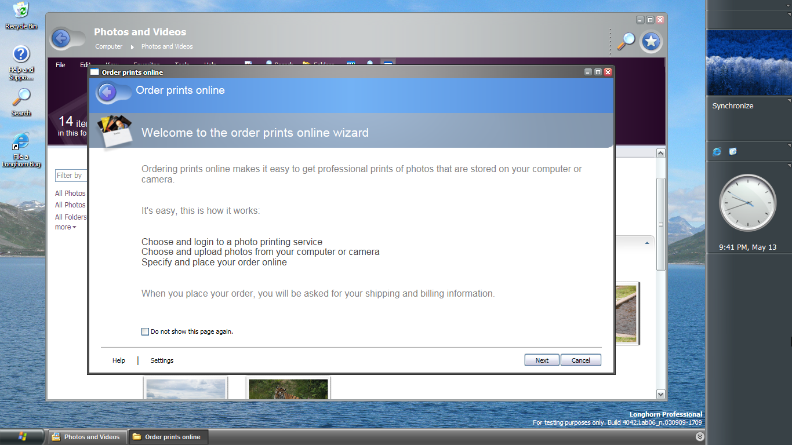

In this post I will have a look at how one can unlock the "full potential' of the wizard - to lift a corner of the veil: it doesn't have a lot of potential. If you can vaguely remember me writing about exactly this subject a few years back.. you are right, but with the switch to the WordPress powered website I totally forgot to place the original article back so here I am revisiting the subject C:

The Online Photo Print Wizard, called `ophotowz` internally, is a wizard to allow sending photos to an online service for printing. It uses the typical "basket' selection interface also seen in other aero wizards. It's known to be available in build 4039, 4042, 4051 and 4053. The wizard should be launchable via the tasks in explorer shown while in the Photos and Videos library. Clicking _Order Prints Online_ will open the wizard. Do note that these tasks may not always show up (tasks need running WinFS and WinFPM services to propagate to the preview panel).



In case the _Order Prints Online_ task do not show you can always launch the wizard manually using the snippet below. Be sure to add a reference to  `ophotowz.dll` from the WinSxS folder.


Microsoft.WindowsMedia.Services.UX.Phodeo.PhotoWizard app
  = new Microsoft.WindowsMedia.Services.UX.Phodeo.PhotoWizard();
app.Run();


[405X Ophotowz](/download/405x-ophotowz.zip)

The default page is a placeholder page which doesn't allow you to continue selecting photos. This placeholder can however be disabled by applying the following registry key.


Windows Registry Editor Version 5.00

[HKEY_LOCAL_MACHINE\SOFTWARE\Microsoft\Windows NT\CurrentVersion\WMIS]
"M6Enabled"=dword:00000001


Restarting the wizard after applying above registry key will show a different page.



Clicking next will now yield an error. The wizard tries to download a file from an internal Microsoft server which is long gone - and obviously wouldn't be available from your network whatsoever. Specifically the file _usa.xml_ is requested from `http://wmisintwebsvc01:1704/testopw/`. In collaboration with JaGoTu, I was able to reconstruct the lay-out of the XML file.


<providermanifest>
  <providers scope="InternetPhotoPrinting">
    <provider id="WinPhoto" enabled="true">
      <strings langid="0000">
        <string id="displayname">Longhorn.us.to</string>
        <string id="description">We actually don't print</string>
        <string id="logoUri">http://wmisintwebsvc01:1704/testopw/logo.png</string>
        <string id="bannerUri">http://wmisintwebsvc01:1704/testopw/banner.png</string>
        <string id="supportedTypes">png,jpeg</string>
        <string id="serviceUri">.</string>
      </strings>
    </provider>
  </providers>
</providermanifest>


This file is read by the `ProviderManager` which creates `ProviderInfo` instances for each available provider. The `ProviderSelectPage` uses these pieces of information to display a list of providers in a listview control.

[OPhotowz Tutorial files](/download/ophotowz-tutorial-files.zip)

Tricking the wizard into thinking it has a real connection with the original internal server is simple. One needs to set up a web server which can easily be done using Apache or Nginx (Windows users can install XAMPP or WAMP). Be sure to map the server to listen at port 1704 instead of the usual port 80! On the server create directory `testopw` in which a file `usa.xml` exists contain above XML snippet.

The next thing that needs to be done is to resolve the machine name (wmisintwebsvc01) to the server you just run. In the Longhorn machine open the `hosts` file located in `Windows\system32\Drivers\etc\`. Add a line mapping your computer's IP to `wmisintwebsvc01`. In my case this means adding the following line:

```
192.168.1.23 wmisintwebsvc01
```

Now, to check if your mapping works, issue a ping command to `wmisintwebsvc01`. You should see the replies come pouring in. If not, make sure you've connected your Longhorn machine to the network correctly.

Now we're ready to run the wizard again. The images below show the workflow: pick a provider, log-in with your provider, pick images. As said before, the basket principle is used here to select images. Simpy browse the file system and drag images to the basket on the right to eventually print them. Note that when there are any images in your basket, the wizard will crash.



A few years back I made a video showing how to open the Online Photo Print wizard. Here is the vid in case you missed it:



The bootstrapper application which is created in the first half of the video isn't strictly necessary if the task items are visible as explained elsewhere in this post.