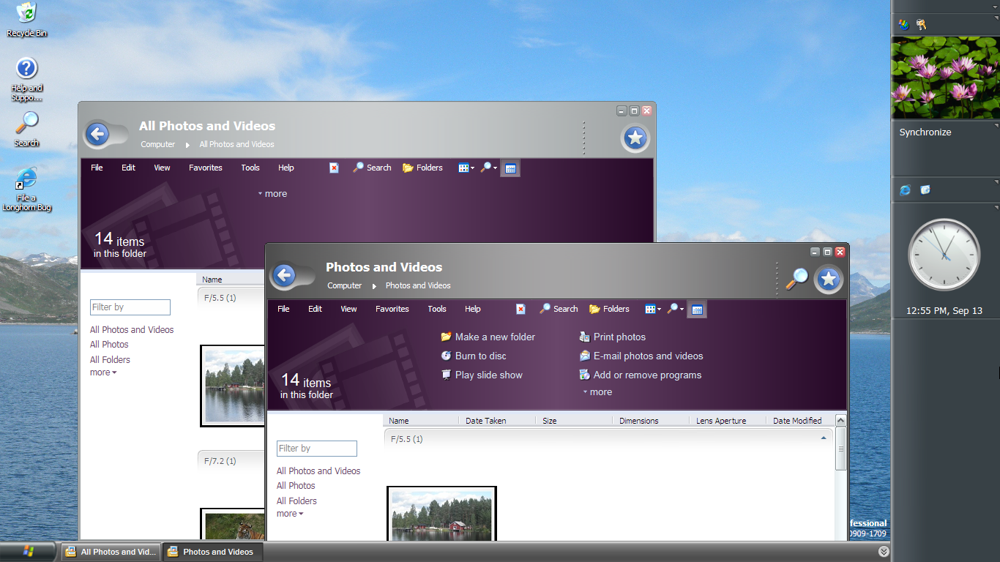

A big new thing in Longhorn were the tasks and help topics integrated into Explorer. Many builds show an empty space where these tasks would go in Explorer's task pane, but no tasks are showing. In this post I'll describe a the step-by-step process of getting these tasks to work on build 4042. The idea is that we go from an empty pane to a nice and completely filled pane like in the image below.



### Tasks, help topics and their file format

Tasks are stored on the system as `*.help` files. These files can be found in `C:\Windows\HELP`. These files are compiled by combining multiple other files such as MAML. The Micorsoft Assistance Markup-Language (MAML) was a new addition to define help topic and tasks in Longhorn. The files defining tasks for explorer are not in MAML format, but rather contain serialized .NET objects defined search and task behavior. A good resource on [how to create your own help files can be found here](https://www.help-info.de/en/Help_Info_AP_Help/longhorn_4051_first_steps.htm).

It is interesting to note that the <em>NuiAnnotations.help</em> file contains a sample snippet of a task definition which was generated using `XMLSpy v4.4`. The root element contains a `snapshotDate` which tells us this sample was created as early as 17 December 2001 at 9:30 AM. This substantiates the claims I made earlier in my article about [the very beginning of Longhorn](/early-development).

### Setting up WinFS

Explorer expects to find tasks stored in the WinFS environment. Therefore we need a working WinFS service. Unfortunately, WinFS in build 4042 doesn't come working out of the box so we need to make some tweaks. On further inspection it seems that WinFS in this build is unable to start due to some error in the order in which the services are loaded - prohibiting `NS$ShellSubscriptions` service to start (This service is responsible for linking the store shell folder and the WinFS database together). Using these steps WinFS will start properly, but after a reboot they will have to be repeated!

Initially, trying to start the service will yield an error:


Now, locate the `Windows File System` Service and restart it and all its sub-services


Now navigate to `C:\Windows\System32\WinFS\log` and open `errorlog` and `FPMErrorLog`. Both files should have some logging information and no errors. A successful initialization of the WinFS database looks something like this:

```
2003-09-11 21:27:10.07 Server Copyright (C) 1988-2001 Microsoft Corporation.
2003-09-11 21:27:10.07 Server All rights reserved.
2003-09-11 21:27:10.07 Server Server Process ID is 580.
2003-09-11 21:27:10.07 Server Logging Windows File System messages in file 'C:\WINDOWS\system32\WinFS\log\errorlog'.
2003-09-11 21:27:10.08 Server Registry Startup Parameters:
2003-09-11 21:27:10.08 Server -d C:\WINDOWS\system32\WinFS\data\master.mdf
2003-09-11 21:27:10.08 Server -e C:\WINDOWS\system32\WinFS\log\errorlog
2003-09-11 21:27:10.08 Server -l C:\WINDOWS\system32\WinFS\data\mastlog.ldf
2003-09-11 21:27:10.08 Server -T 5503
2003-09-11 21:27:10.08 Server -T 5504
2003-09-11 21:27:10.08 Server -T 1807
2003-09-11 21:27:10.10 Server Windows File System is starting at priority class 'normal'(2 CPUs detected).
2003-09-11 21:27:10.29 Server Windows File System configured for thread mode processing.
2003-09-11 21:27:10.29 Server Using dynamic lock allocation. [120] Lock Blocks, [240] Lock Owner Blocks.
2003-09-11 21:27:10.33 spid5 Starting up database 'master'.
2003-09-11 21:27:10.34 spid5 Recovery is checkpointing database 'master' (1)
2003-09-11 21:27:10.36 spid5 Starting up database 'mssqlsystemresource'.
2003-09-11 21:27:10.39 Server Using 'SNI' version '0'.
2003-09-11 21:27:10.39 spid5 Server name is 'LH-X8TWZ62HD439\WINFS'.
2003-09-11 21:27:10.40 spid5 Recovery complete.
2003-09-11 21:27:10.40 Server Windows File System is ready for client connections<
```

As soon as the Windows File Promotion Manager service starts `FPMErrorLog` will contain logging info. As soon as WinFPM starts WinFS will start the `WinFS_Catalog` database and a `Store` database. The WinFPM service will install any pending schemas. To check whether all shared folders were created correctly, pop open `compmgmt.msc` and browse to Shared Folders. You should see a `SQL_{UUID}` share. This shared folder holds information about the filestream which allows the actual WinFS SQL database to save files on the local disk (instead of saving byte blobs in the database).  Read more about [FILESTREAMs in Transact-SQL here](https://docs.microsoft.com/en-us/sql/relational-databases/blob/filestream-sql-server?view=sql-server-2017).


As you can see, a System Catalog Store and a System Default Store have been created along with the FILESTREAM Container Share. The DefaultStore is the "entry points" for WinFS in which you can dump your files. This folder, however, is still completely invisible in the shell at this points. You should now locate the `NS$ShellSubscriptions` service and start it - it should start without any problems now. If you experience any problems I bet you haven't waited long enough to let WinFS completely initialize. Since the Shell subscriptions service is now active (e.g. the shell responds to WinFS database events and vice versa), the shell will start to display some new items. One of which is the DefaultStore shared folder in Computer. Dragging folders and files into this folder will hand them off to the File Promotion Manager which will eventually include them into the WinFS database.


Eventually all files in the DefaultStore show up in the right shell folder (e.g. image files in Photos and Videos etc.). Note that double-clicking the item will do nothing. If you are eager to see the contents of the folder; right-click and choose Explore.

### Tasks & help topics as a by-product

If you paid close attention, you might have notices that shell tasks have populated the task pane in the meantime. If you lack patience - like I do - you can force this update by executing the Natural UI Metadata Promotion Manager (NuiMPMPx.exe located in Sytem32) this will create a PromotionManager that relies on the WinFPM manager to execute stored procedures in tables Help (PromoteMetaData), ShellTask (PromoteTaskAssembly) and NaturalUI (AddAnnotationAssociation). You should end up with something like below. Opening Help & Support will now also show help topics. Double-clicking an item will open up a help pane to show detailed steps.



That's it for this time&#8230;